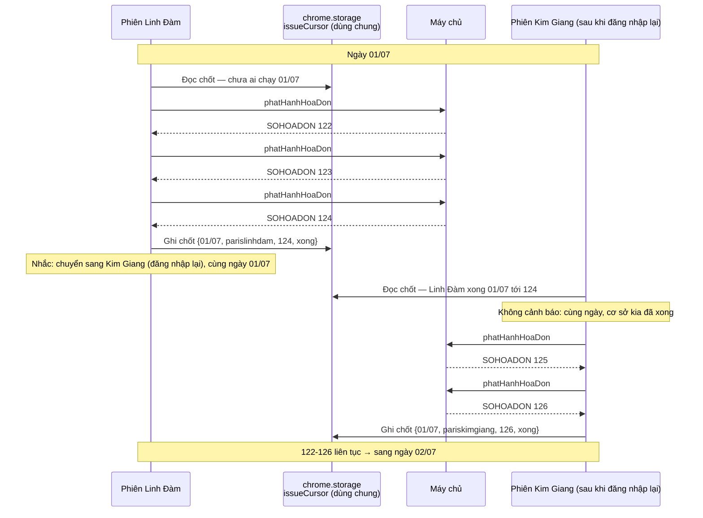

# Phát hành hóa đơn tuần tự (số hóa đơn liên tục theo ngày, xen kẽ hai cơ sở)

Tài liệu này là flow chart cho yêu cầu: **trong cùng một ngày, số hóa đơn điện tử
(`SOHOADON`) của cả hai cơ sở phải liên tục và không rối loạn.**

Ví dụ nghiệp vụ: ngày 01/07 Linh Đàm phát hành 3 hóa đơn số 122, 123, 124 thì Kim
Giang phát hành tiếp ngay sau đó 125, 126… rồi mới sang ngày 02/07.

## Ba tầng thứ tự — chỉ tầng 3 là ràng buộc

| Tầng | Số gì | Ai cấp | Kiểm soát được? |
|---|---|---|---|
| 1 | Thứ tự xử lý giao dịch | Extension | Có |
| 2 | `invoiceNo` — số phiếu bán hàng | Máy chủ, lúc **tạo phiếu** | Không |
| 3 | `SOHOADON` — số hóa đơn điện tử | Máy chủ, lúc **phát hành** | **Có — qua thứ tự gọi API** |

Điểm mấu chốt: `SOHOADON` được cấp tăng dần theo đúng thứ tự lời gọi
`phatHanhHoaDon` đến máy chủ. Vì vậy **thứ tự phát hành chính là thứ tự đánh số**.

Hệ quả quan trọng: tầng 3 **không phụ thuộc** tầng 2. Lô phát hành được sắp theo
*giờ giao dịch trong sao kê* — dữ liệu extension kiểm soát hoàn toàn — chứ không
theo `invoiceNo`. Nhờ đó `SOHOADON` vẫn liên tục và đúng thứ tự nghiệp vụ kể cả
khi `invoiceNo` lộn xộn do phiếu mới xen kẽ phiếu có sẵn.

Tầng 2 được chấp nhận không liên tục. Riêng phiếu tạo mới của Linh Đàm xếp theo
ngày tạo của máy chủ (`isLinhDamFreshApiInvoice`) — giữ nguyên hành vi hiện tại.

## Dữ liệu đối chiếu: sao kê của cả hai cơ sở

Chốt tiến độ chỉ ghi lại **sau khi** một cơ sở phát hành xong, nên trước khi chạy
extension vẫn mù: không biết cơ sở kia ngày đó có việc không, bao nhiêu giao dịch.

Sao kê của cơ sở kia lấp khoảng trống đó — nó là **dữ liệu biết trước**. Ngày
01/07 Linh Đàm có 3 giao dịch Credit, Kim Giang có 2 → biết ngay dải số sẽ là
122-124 rồi 125-126, **trước khi phát hành hóa đơn nào**.

### Sao kê đối chiếu tách khỏi sao kê chính

`statementDataset` của mỗi cơ sở **giữ nguyên**, lưu theo `tenantKey()` như hiện
tại. Gộp hai sao kê vào một dataset sẽ hỏng luồng lập phương án: giao dịch của cơ
sở kia không có phiếu tương ứng trên website đang mở.

Thay vào đó, thêm một khóa **dùng chung** (không qua `tenantKey()`, theo tiền lệ
`SHARED_WAREHOUSE_KEY`) chứa bảng tóm tắt rất mỏng:

```
{ tenant, ngày, số giao dịch Credit, danh sách {giờ, số tiền}, nhập lúc }
```

Chỉ chừng đó — không mang phương án, phiếu hay tồn kho.

**Bắt buộc: parse theo `tenantSlug` của chính file đó, không phải của tab đang mở.**
Hai cơ sở dùng cột ngày khác nhau (`xlsx-reader.js` `parseBankRows`):

| Cơ sở | Ngày nghiệp vụ | Giờ thật (`requestedAt`) |
|---|---|---|
| Kim Giang | `Transaction date` | `Requesting date` |
| Linh Đàm | `Ngày hiệu lực` | `Ngày giao dịch` |

Import sai `tenantSlug` sẽ đọc lệch cột — hỏng đúng thứ cần chính xác nhất. Mỗi
cơ sở tự import sao kê của mình ở tab của mình; bảng tóm tắt tự chảy sang khóa
dùng chung. Nếu import cả hai file trong cùng một tab thì ô import phải có bộ chọn
cơ sở để truyền đúng `tenantSlug`.

## Ràng buộc nền: không thể mở song song hai cơ sở

Hai cơ sở dùng **chung một domain** (`banhang.thuanvietsoft.com/<coso>/...`).
Cookie phiên đăng nhập gắn theo **domain**, không theo đường dẫn, nên đăng nhập
cơ sở này sẽ **ghi đè phiên của cơ sở kia** và đá tab đó ra màn hình login.

Hệ quả:

- Quy trình thực tế là **đăng nhập luân phiên**, không phải mở hai tab song song.
- Điều phối tự động chéo tab (phương án B từng cân nhắc) là **bất khả thi** về
  mặt kỹ thuật, không chỉ rủi ro.
- Ba thành phần dùng chung vẫn hoạt động bình thường vì chúng đi qua
  `chrome.storage.local`, **không phụ thuộc phiên đăng nhập** — miễn là cùng một
  profile Chrome. Khác profile thì chúng không thấy nhau.
- Không có chuyện hai lô chạy đồng thời. Chốt còn kẹt ở `running` nghĩa là lô
  trước **bị đứt giữa chừng** (đóng tab, mất mạng, hết phiên), và một phần hóa
  đơn có thể đã được cấp số mà chưa vào sổ.

Mất phiên thường trả **HTTP 200 kèm HTML trang login**, không phải 401/403.
`isLoginRedirect()` trong `bridge.js` nhận diện theo ba dấu hiệu độc lập (mã
trạng thái, URL cuối cùng sau chuyển hướng, dấu vết form đăng nhập trong HTML)
và dừng hẳn cả luồng phát hành lẫn luồng lưu phiếu. Không có bước này thì
`JSON.parse` thất bại lặng lẽ và lô chạy tiếp như không có gì xảy ra.

## Thứ tự giữa hai cơ sở — cờ config

Cơ sở nào phát hành trước trong cùng một ngày do **cờ config trên UI** quyết định.
Mặc định **Linh Đàm trước**.

- Cờ nằm ở khóa **dùng chung**, không phải `uiSession` (`uiSession` lưu theo
  `tenantKey()` nên mỗi tab sẽ thấy một giá trị khác nhau — sai hoàn toàn với một
  quy ước phải thống nhất giữa hai cơ sở).
- Cả hai cơ sở đọc cùng một cờ (cùng profile Chrome), nên không có chuyện mỗi bên tưởng mình đi trước.
- Extension dùng cờ để **chỉ định** cơ sở nào chạy trước, không chỉ cảnh báo: cơ
  sở đi sau sẽ được nhắc rõ "theo cấu hình, Linh Đàm phát hành trước; ngày 01/07
  Linh Đàm còn 3 giao dịch chưa phát hành".
- Đổi cờ phải đọc lại bản ghi dùng chung trước khi ghi, nếu không sẽ xóa mất chốt
  mà phiên trước đã ghi vào cùng bản ghi đó.

## Bất biến bắt buộc

- Cả lô chạy **một luồng**. Không `Promise.all`, không chia giai đoạn theo bất kỳ
  tiêu chí nào khác.
- `targets` được sắp theo `dateKey` → `requestedAt` → `invoiceNo` **trước** khi
  vào vòng phát hành.
- Một lô chỉ chứa **đúng một ngày**, và điều này được **ép** ở hai tầng: danh sách
  khóa `toDate = fromDate` ngay khi tải, còn luồng phát hành chặn cứng nếu vẫn lọt
  nhiều ngày. Lô trộn nhiều ngày sẽ chiếm luôn phần số mà cơ sở kia cần cho ngày
  sớm hơn, và phát hành rồi thì không hoàn tác được.
- Chốt tiến độ chéo cơ sở là **chặn mềm**: cảnh báo rõ, người dùng vẫn quyết định.
- Mọi phản hồi đi qua `respond()`; hết hạn chờ **không** kết luận là chưa phát hành.

## Flow chart

```mermaid
flowchart TD
    A[Người dùng mở bước 5<br/>Phát hành hóa đơn] --> B[loadEInvoiceList<br/>fetchEInvoiceList theo Từ/Đến ngày]
    B --> C[Danh sách KHÓA theo đúng một ngày<br/>toDate ép bằng fromDate<br/>nút ‹ Ngày trước / Ngày sau › để chuyển]
    C --> D[Người dùng tích chọn các dòng<br/>chỉ trong số dòng đang hiện]

    D --> E[targets = dòng đã chọn<br/>chưa phát hành, chưa hủy]
    E --> F{Có dòng nào<br/>không khớp sao kê?<br/>statementInvoiceMatch}
    F -- Có --> Z2[Chặn cứng cả lô<br/>nêu rõ mã, ngày, số tiền lệch]
    F -- Không --> F2{Lô vẫn lọt<br/>nhiều ngày?}
    F2 -- Có --> Z5[Chặn cứng: mỗi lô đúng một ngày<br/>phát hành rồi không hoàn tác được]
    F2 -- Không --> G

    G[SẮP XẾP targets<br/>dateKey → requestedAt → invoiceNo] --> G1[Đọc dữ liệu dùng chung:<br/>cờ thứ tự cơ sở + sao kê đối chiếu + chốt tiến độ]

    G1 --> G2{Cờ config:<br/>cơ sở này đi trước?}
    G2 -- Có --> H
    G2 -- Không --> G3{Sao kê đối chiếu:<br/>cơ sở đi trước còn giao dịch<br/>chưa phát hành ngày này?}
    G3 -- Có --> G4[⚠ Theo cấu hình, cơ sở kia phát hành trước<br/>ngày này họ còn N giao dịch chưa chạy]
    G3 -- Không --> H
    G3 -- Chưa import sao kê --> G5[⚠ Chưa có sao kê đối chiếu<br/>không xác minh được cơ sở kia đã xong chưa]
    G4 --> H
    G5 --> H

    H{Cơ sở kia đã phát hành<br/>ngày LỚN HƠN ngày lô này?}
    H -- Có --> H1[⚠ Cảnh báo mạnh:<br/>số sẽ chèn ngược vào dải đã dùng]
    H -- Không --> J
    H1 --> J

    J{Chốt còn kẹt ở running?<br/>cơ sở kia HOẶC chính mình}
    J -- Có --> J1[⚠ Lô trước bị đứt giữa chừng<br/>một phần hóa đơn có thể đã cấp số<br/>mà chưa vào sổ — kiểm tra trước khi chạy tiếp]
    J -- Không --> K
    J1 --> K

    K[Kiểm tra nguồn mặt hàng<br/>ledgerItemsForInvoiceNo cho từng dòng] --> L{Có dòng nào<br/>thiếu trong sổ đối soát?}
    L -- Có --> L1[ensureInvoiceListScreen] --> L2{Mở được<br/>danh sách Bán hàng?}
    L2 -- Không --> Z3[Chặn cả lô:<br/>không đọc được mặt hàng để hạch toán]
    L2 -- Có --> M
    L -- Không --> M

    M[HỘP THOẠI XÁC NHẬN MỘT LẦN CHO CẢ LÔ<br/>số hóa đơn, tổng tiền, thứ tự sẽ phát hành<br/>dải số dự kiến tính từ sao kê đối chiếu<br/>+ mọi cảnh báo ở trên] --> N{Xác nhận?}
    N -- Không --> Z4[Hủy, không gọi API nào]
    N -- Có --> O

    O[VÒNG TUẦN TỰ — MỘT LUỒNG<br/>for row of targets] --> P[processTarget row]
    P --> Q[Lấy mặt hàng:<br/>ưu tiên sổ đối soát, thiếu thì mở phiếu đọc]
    Q --> R[kiemTraThongTin]
    R --> S[phatHanhHoaDon<br/>→ máy chủ cấp SOHOADON kế tiếp]

    S --> T{Thành công?}
    T -- Có --> U[Ghi sổ NGAY<br/>InvoiceIssuedBook.record + saveIssuedInvoices]
    T -- Không / hết hạn chờ --> V[confirmIssuedAfterFailure<br/>đọc lại trạng thái THẬT từ server]
    V --> W{Thực tế đã phát hành?}
    W -- Có --> U2[Ghi sổ + cảnh báo mất phản hồi] --> X
    W -- Không --> V2[Ghi vào failures] --> X
    U --> X

    X{Còn dòng tiếp theo?}
    X -- Có --> P
    X -- Không --> Y[Ghi chốt tiến độ<br/>ngày, tenant, SOHOADON cuối, xong lúc]

    Y --> Y1[Kiểm tra tính liên tục<br/>SOHOADON trong ngày có đứt quãng?<br/>có số của cơ sở kia chèn giữa?]
    Y1 --> Y2[Nhắc chuyển cơ sở:<br/>Ngày 01/07 Linh Đàm xong tới 124.<br/>Chuyển sang Kim Giang - đăng nhập lại -<br/>phát hành cùng ngày 01/07 trước khi sang 02/07]
    Y2 --> Y3{Đã phát hành được<br/>và không thiếu mặt hàng?}
    Y3 -- Có --> Y4[Mời xuất file hạch toán]
    Y3 -- Không --> Y5[Nêu rõ số hóa đơn lỗi / thiếu mặt hàng]
```



## Trình tự chéo hai cơ sở (một ngày)



## Nhánh cảnh báo chéo cơ sở

| Tình huống | Nguồn | Xử lý |
|---|---|---|
| Cơ sở này đi trước theo cờ config | cờ dùng chung | Chạy bình thường |
| Cơ sở đi trước còn giao dịch chưa phát hành ngày D | sao kê đối chiếu + chốt | ⚠ Nhắc rõ: theo cấu hình họ chạy trước, còn N giao dịch |
| Cơ sở đi trước đã xong ngày D | chốt `{ngày = D, xong}` | Chạy bình thường, số nối tiếp |
| Chưa import sao kê cơ sở kia | thiếu bảng đối chiếu | ⚠ Không xác minh được — nêu rõ trong hộp thoại |
| Cơ sở kia đã phát hành ngày > D | chốt `{ngày > D}` | ⚠ Cảnh báo mạnh — số chèn ngược vào dải đã dùng |
| Chốt kẹt ở `running` (bên nào cũng vậy) | chốt `{ngày = D, running}` | ⚠ Lô trước đứt giữa chừng — một phần có thể đã cấp số mà chưa vào sổ |
| Cơ sở kia không có giao dịch ngày D | sao kê đối chiếu: 0 dòng | Chạy bình thường |

Tất cả đều **chặn mềm**: nêu rõ trong hộp thoại xác nhận, người dùng quyết định.
Chặn cứng sẽ kẹt khi một cơ sở không có hóa đơn nào trong ngày — và với sao kê đối
chiếu, trường hợp đó nay **phân biệt được** với "chưa chạy", nên cảnh báo chính xác
hơn hẳn: `0 giao dịch` khác `chưa import` khác `có việc nhưng chưa chạy`.

## Đánh đổi đã chấp nhận

**Bỏ chạy song song.** Bản hiện tại chia lô làm hai giai đoạn nối tiếp: nhóm đã
có mặt hàng trong sổ đối soát chạy thuần API với 2 luồng song song
(`Math.min(2, apiOnly.length)`), rồi mới tới nhóm phải mở giao diện.

Cách đó nhanh hơn nhưng làm rối số hóa đơn theo **hai** đường:
1. Hai luồng song song về đích theo độ trễ mạng, không theo thứ tự gửi.
2. Việc tách giai đoạn xáo thứ tự theo tiêu chí "đã có mặt hàng trong sổ hay chưa"
   — hoàn toàn không liên quan tới giờ giao dịch.

Song song và "số hóa đơn liên tục" là hai mục tiêu loại trừ nhau. Chọn thứ tự,
mất tốc độ — lô toàn phiếu đã có mặt hàng sẽ chậm khoảng gấp đôi.

**Ảnh hưởng tới test.** `tests/test-issued-invoices.js` hiện khóa chặt hành vi
song song: assert `Math.min(2, apiOnly.length)`, đòi `Promise.all` đứng trước
`needsUi`, yêu cầu tách hai giai đoạn. Các assert này mâu thuẫn trực tiếp với
yêu cầu mới và phải được viết lại kèm lý do đánh đổi.

**Giữ nguyên hạn chờ tách theo đường chạy.** `ISSUE_TIMEOUT_FAST_MS = 30000` khi
có sẵn mặt hàng, `ISSUE_TIMEOUT_UI_MS = 90000` khi phải mở giao diện. Hạn chờ
ngắn chỉ an toàn nhờ `confirmIssuedAfterFailure` đọc lại trạng thái thật từ máy
chủ — quá hạn không bao giờ được kết luận là chưa phát hành.

## Điểm chạm trong code

| Việc | Vị trí |
|---|---|
| Bỏ song song, gộp một vòng tuần tự | `content.js` — `issueSelectedEInvoices`, khối `apiOnly`/`needsUi` |
| Sắp `targets` theo ngày → giờ giao dịch | `content.js` — `issueSelectedEInvoices`, ngay sau khi lọc `targets` |
| Giờ giao dịch thật | `requestedAt`, parse tại `xlsx-reader.js` `parseBankRows` |
| Khóa lô một ngày | `content.js` — `suggestedEInvoiceRange`, `loadEInvoiceList` |
| Chốt tiến độ dùng chung | `mapping-store.js` — khóa mới, **không** qua `tenantKey()`, theo tiền lệ `SHARED_WAREHOUSE_KEY` |
| Bảng sao kê đối chiếu (dùng chung) | `mapping-store.js` — khóa mới, không qua `tenantKey()` |
| Trích bảng đối chiếu khi import | `content.js` — `importStatementFile`, sau khi parse |
| Cờ thứ tự cơ sở (dùng chung, mặc định `parislinhdam`) | `mapping-store.js` + UI ở bước 5 |
| Kiểm tra liên tục sau lô | `content.js` — sau vòng lặp, đọc `issuedInvoiceBook` |
| Ghi sổ từng hóa đơn | `content.js` — `InvoiceIssuedBook.record` + `saveIssuedInvoices` (giữ nguyên) |
