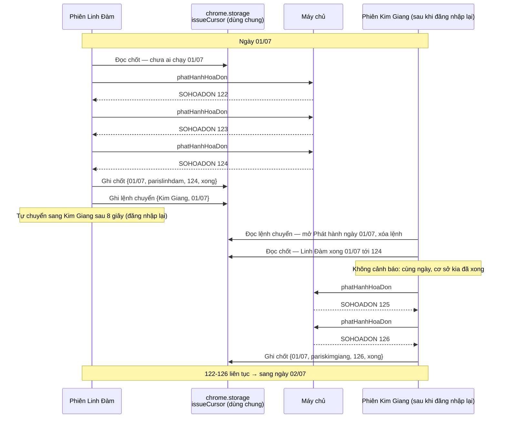

# Phát hành hóa đơn tuần tự (số hóa đơn liên tục theo ngày, xen kẽ hai cơ sở)

Tài liệu này là flow chart cho yêu cầu: **trong cùng một ngày, số hóa đơn điện tử
(`SOHOADON`) của cả hai cơ sở phải liên tục và không rối loạn.**

Ví dụ nghiệp vụ: ngày 01/07 Linh Đàm phát hành 3 hóa đơn số 122, 123, 124 thì Kim
Giang phát hành tiếp ngay sau đó 125, 126… rồi mới sang ngày 02/07.

## Ba tầng thứ tự — chỉ tầng 3 là ràng buộc

| Tầng | Số gì | Ai cấp | Kiểm soát được? |
|---|---|---|---|
| 1 | Thứ tự xử lý giao dịch | Extension | Có |
| 2 | `invoiceNo` — số phiếu bán hàng | Máy chủ, lúc **tạo phiếu** | Không |
| 3 | `SOHOADON` — số hóa đơn điện tử | Máy chủ, lúc **phát hành** | **Có — qua thứ tự gọi API** |

Điểm mấu chốt: `SOHOADON` được cấp tăng dần theo đúng thứ tự lời gọi
`phatHanhHoaDon` đến máy chủ. Vì vậy **thứ tự phát hành chính là thứ tự đánh số**.

Hệ quả quan trọng: tầng 3 **không phụ thuộc** tầng 2. Lô phát hành được sắp theo
*giờ giao dịch trong sao kê* — dữ liệu extension kiểm soát hoàn toàn — chứ không
theo `invoiceNo`. Nhờ đó `SOHOADON` vẫn liên tục và đúng thứ tự nghiệp vụ kể cả
khi `invoiceNo` lộn xộn do phiếu mới xen kẽ phiếu có sẵn.

Tầng 2 được chấp nhận không liên tục. Riêng phiếu tạo mới của Linh Đàm xếp theo
ngày tạo của máy chủ (`isLinhDamFreshApiInvoice`) — giữ nguyên hành vi hiện tại.

## Dữ liệu đối chiếu: sao kê của cả hai cơ sở

Chốt tiến độ chỉ ghi lại **sau khi** một cơ sở phát hành xong, nên trước khi chạy
extension vẫn mù: không biết cơ sở kia ngày đó có việc không, bao nhiêu giao dịch.

Sao kê của cơ sở kia lấp khoảng trống đó — nó là **dữ liệu biết trước**. Ngày
01/07 Linh Đàm có 3 giao dịch Credit, Kim Giang có 2 → biết ngay dải số sẽ là
122-124 rồi 125-126, **trước khi phát hành hóa đơn nào**.

### Sao kê đối chiếu tách khỏi sao kê chính

`statementDataset` của mỗi cơ sở **giữ nguyên**, lưu theo `tenantKey()` như hiện
tại. Gộp hai sao kê vào một dataset sẽ hỏng luồng lập phương án: giao dịch của cơ
sở kia không có phiếu tương ứng trên website đang mở.

Thay vào đó, thêm một khóa **dùng chung** (không qua `tenantKey()`, theo tiền lệ
`SHARED_WAREHOUSE_KEY`) chứa bảng tóm tắt rất mỏng:

```
{ tenant, ngày, số giao dịch Credit, danh sách {giờ, số tiền}, nhập lúc }
```

Chỉ chừng đó — không mang phương án, phiếu hay tồn kho.

**Bắt buộc: parse theo `tenantSlug` của chính file đó, không phải của tab đang mở.**
Hai cơ sở dùng cột ngày khác nhau (`xlsx-reader.js` `parseBankRows`):

| Cơ sở | Ngày nghiệp vụ | Giờ thật (`requestedAt`) |
|---|---|---|
| Kim Giang | `Transaction date` | `Requesting date` |
| Linh Đàm | `Ngày hiệu lực` | `Ngày giao dịch` |

Import sai `tenantSlug` sẽ đọc lệch cột — hỏng đúng thứ cần chính xác nhất. Mỗi
cơ sở tự import sao kê của mình ở tab của mình; bảng tóm tắt tự chảy sang khóa
dùng chung. Nếu import cả hai file trong cùng một tab thì ô import phải có bộ chọn
cơ sở để truyền đúng `tenantSlug`.

## Ràng buộc nền: không thể mở song song hai cơ sở

Hai cơ sở dùng **chung một domain** (`banhang.thuanvietsoft.com/<coso>/...`).
Cookie phiên đăng nhập gắn theo **domain**, không theo đường dẫn, nên đăng nhập
cơ sở này sẽ **ghi đè phiên của cơ sở kia** và đá tab đó ra màn hình login.

Hệ quả:

- Quy trình thực tế là **đăng nhập luân phiên**, không phải mở hai tab song song.
- Điều phối tự động chéo tab (phương án B từng cân nhắc) là **bất khả thi** về
  mặt kỹ thuật, không chỉ rủi ro.
- Ba thành phần dùng chung vẫn hoạt động bình thường vì chúng đi qua
  `chrome.storage.local`, **không phụ thuộc phiên đăng nhập** — miễn là cùng một
  profile Chrome. Khác profile thì chúng không thấy nhau.
- Không có chuyện hai lô chạy đồng thời. Chốt còn kẹt ở `running` nghĩa là lô
  trước **bị đứt giữa chừng** (đóng tab, mất mạng, hết phiên), và một phần hóa
  đơn có thể đã được cấp số mà chưa vào sổ.

Mất phiên thường trả **HTTP 200 kèm HTML trang login**, không phải 401/403.
`isLoginRedirect()` trong `bridge.js` nhận diện theo ba dấu hiệu độc lập (mã
trạng thái, URL cuối cùng sau chuyển hướng, dấu vết form đăng nhập trong HTML)
và dừng hẳn cả luồng phát hành lẫn luồng lưu phiếu. Không có bước này thì
`JSON.parse` thất bại lặng lẽ và lô chạy tiếp như không có gì xảy ra.

## Tự chuyển cơ sở sau khi phát hành (từ 1.29.23)

Trước đây phát hành xong một cơ sở chỉ có dòng nhắc; người dùng phải tự gõ URL
cơ sở kia rồi chọn lại ngày. Nay:

1. Lô xong, `InvoiceIssueCoordination.nextHandoff(state, tenant, ngày)` tính bước
   kế tiếp: cơ sở **đứng sau** trong dãy còn giao dịch ngày đó và chưa chốt xong
   (bỏ qua cơ sở không có việc); hết thì **ngày kế tiếp** có sao kê, bắt đầu lại
   từ **đầu dãy**. Ví dụ dãy Linh Đàm → Kim Giang: LĐ xong 01/08 → KG 01/08; KG
   xong 01/08 → LĐ 02/08.
2. Bước kế ở cơ sở khác: ghi lệnh chuyển `invoiceTargetIssueHandoffV1` (khóa dùng
   chung, không qua `tenantKey`) gồm cơ sở đích, **ngày**, URL màn Hóa đơn điện tử
   của cơ sở đích (chỉ thay đoạn cơ sở trong URL hiện tại).
   - Lô **sạch** (không lỗi, không cảnh báo, không thiếu mặt hàng, số liên tục,
     không còn phiếu của giao dịch sao kê ngày đó chưa phát hành): đếm ngược
     8 giây rồi tự chuyển, có nút **Chuyển ngay** / **Ở lại trang này**. Mọi thông
     báo khác xuất hiện trong lúc đếm (người dùng thao tác, lỗi) đều hủy chuyển.
   - Lô có vấn đề: không tự chuyển; dòng trạng thái có nút **Chuyển sang …** (và
     **Xuất file hạch toán** nếu đủ điều kiện) để người dùng đọc xong rồi tự bấm.
3. Bước kế ở chính cơ sở này (ngày kế): không chuyển trang, chỉ có nút **Tải
   ngày …**. Hết việc: xóa lệnh chuyển cũ, mời xuất file hạch toán như trước.
4. Ở cơ sở đích, lúc khởi tạo:
   - Trang đăng nhập (`/<cơ sở>/Login?Url=…`, từ 1.29.24): website điền sẵn tài
     khoản `Admin`, không cần mật khẩu, người dùng chỉ bấm **Đăng nhập** — nên
     extension bấm hộ nút `#btnDangnhap` **một lần** cho mỗi lệnh chuyển
     (`loginAttemptAt`), rồi website tự quay về đúng URL trong `Url`. Extension
     không bao giờ điền tài khoản/mật khẩu. Không bấm, để người dùng tự đăng nhập,
     khi: form không phải của cơ sở này, đang ở chế độ đăng nhập bằng mã số, ô
     "Mã xác thực" hiện ra, ô Tài khoản trống, website đang báo lỗi, hoặc đã bấm
     một lần mà vẫn quay lại trang đăng nhập. Không có lệnh chuyển thì không bao
     giờ tự đăng nhập.
   - Cookie `shop` còn của cơ sở cũ (không phải trang đăng nhập): chờ, giữ lệnh,
     nhắc đăng nhập. Lệnh sống 12 giờ.
   - Đăng nhập xong mà website đưa về trang khác: mở lại màn Hóa đơn điện tử
     **một lần** (phát hành phải chạy ở đúng màn đó để gửi đúng tham số).
   - Ở đúng màn: xóa lệnh, mở panel → Phát hành với **ngày mang sang** và tải danh
     sách (chỉ đọc), rồi **tích sẵn** mọi hóa đơn chưa phát hành thuộc giao dịch
     sao kê và khớp giao dịch (đúng tập "Chọn tất cả" chọn được; từ 1.29.25). Phiếu
     ngoài giao dịch hoặc lệch sao kê không bao giờ được tích sẵn. **Không tự phát
     hành** — người dùng kiểm tra rồi bấm Phát hành. Nút **Tải ngày …** (cùng cơ sở,
     ngày kế) cũng tích sẵn như vậy.
   - Bỏ qua lệnh quá hạn, lệnh cho ngày cơ sở này đã chốt xong, hoặc khi lô Batch
     đang tự chạy tiếp sau tải lại / tab phụ tạo phiếu.

Paris Nhơn có dải số riêng nên không tạo và không xóa lệnh chuyển.

## Tự động phát hành theo khoảng ngày (từ 1.29.26)

Hàng **Tự động phát hành** ở màn Phát hành: chọn Từ ngày – Đến ngày, bấm một lần,
xác nhận một lần cho cả khoảng. Phát hành tay (chọn rồi bấm **Phát hành N hóa đơn ·
X đ**) giữ nguyên.

- **Thứ tự:** Kim Giang/Linh Đàm đi theo `firstPendingStep` rồi `nextHandoff(…,
  Đến ngày)`: mỗi ngày theo dãy thứ tự phát hành, xong mọi cơ sở mới sang ngày kế;
  cơ sở/ngày không có giao dịch hoặc đã chốt xong được bỏ qua. Paris Nhơn đi lần
  lượt các ngày có giao dịch trong sao kê của chính Nhơn, không chuyển cơ sở.
- **Mỗi bước** (luôn ở màn Hóa đơn điện tử của đúng cơ sở): tải danh sách ngày đó →
  kiểm tra điều kiện dừng → tích sẵn → **đếm ngược 5 giây** (nút **Dừng tự động
  phát hành**) → phát hành → bước kế. Sang cơ sở khác thì đếm ngược 5 giây rồi
  chuyển trang, tự bấm Đăng nhập như luồng tay; trang đích chạy tiếp.
- **Dừng hẳn** (không phát hành, không chuyển đi; có nút **Chạy tiếp tự động**) khi:
  - còn giao dịch sao kê ngày đó chưa xử lý xong (khác Đã xử lý/Bỏ qua) — phát hành
    lúc này thì phiếu còn lại sẽ phát hành sau cơ sở kia, đứt dải số;
  - có phiếu của giao dịch sao kê lệch sao kê;
  - lô cần người đọc: phiếu ngoài danh sách giao dịch, hoặc bất kỳ cảnh báo chéo cơ
    sở nào (luồng tay sẽ hỏi xác nhận; luồng tự động không bao giờ tự bấm qua);
  - lô vừa chạy không sạch: có hóa đơn lỗi, cảnh báo, thiếu mặt hàng, số không liên
    tục, hoặc còn phiếu chưa phát hành;
  - cookie `shop` đang là cơ sở khác; không mở được màn Hóa đơn điện tử; mọi lỗi khác.
- **Ngày không còn gì để phát hành** (mọi phiếu của giao dịch đã phát hành): ghi chốt
  `done` cho ngày đó rồi đi tiếp, để lần chạy lại không quay lại.
- **Chạy tiếp** sau khi dừng: cùng khoảng ngày, bắt đầu lại từ bước còn việc sớm nhất.
- **Trạng thái lượt chạy** ở `invoiceTargetAutoIssueV1` (khóa dùng chung):
  `status` running/stopped/done, khoảng ngày, `scope` (`shared` hoặc `parisnhon`),
  bước hiện tại, các bước đã chạy kèm số hóa đơn. Không cập nhật quá 12 giờ thì coi
  như đã dừng. Trang bị tải lại giữa chừng (không có lệnh chuyển) **không** tự chạy
  tiếp — chỉ hiện nút Chạy tiếp / Dừng.
- Lệnh chuyển của lượt tự động mang cờ `auto`; lượt đã dừng/quá hạn thì trang đích
  chỉ mở đúng ngày và tích sẵn như luồng tay.

## Thứ tự giữa hai cơ sở — cờ config

Cơ sở nào phát hành trước trong cùng một ngày do **cờ config trên UI** quyết định.
Mặc định **Linh Đàm trước**.

- Cờ nằm ở khóa **dùng chung**, không phải `uiSession` (`uiSession` lưu theo
  `tenantKey()` nên mỗi tab sẽ thấy một giá trị khác nhau — sai hoàn toàn với một
  quy ước phải thống nhất giữa hai cơ sở).
- Cả hai cơ sở đọc cùng một cờ (cùng profile Chrome), nên không có chuyện mỗi bên tưởng mình đi trước.
- Extension dùng cờ để **chỉ định** cơ sở nào chạy trước, không chỉ cảnh báo: cơ
  sở đi sau sẽ được nhắc rõ "theo cấu hình, Linh Đàm phát hành trước; ngày 01/07
  Linh Đàm còn 3 giao dịch chưa phát hành".
- Đổi cờ phải đọc lại bản ghi dùng chung trước khi ghi, nếu không sẽ xóa mất chốt
  mà phiên trước đã ghi vào cùng bản ghi đó.

## Bất biến bắt buộc

- Cả lô chạy **một luồng**. Không `Promise.all`, không chia giai đoạn theo bất kỳ
  tiêu chí nào khác.
- `targets` được sắp theo `dateKey` → `requestedAt` → `invoiceNo` **trước** khi
  vào vòng phát hành.
- Một lô chỉ chứa **đúng một ngày**, và điều này được **ép** ở hai tầng: danh sách
  khóa `toDate = fromDate` ngay khi tải, còn luồng phát hành chặn cứng nếu vẫn lọt
  nhiều ngày. Lô trộn nhiều ngày sẽ chiếm luôn phần số mà cơ sở kia cần cho ngày
  sớm hơn, và phát hành rồi thì không hoàn tác được.
- Chốt tiến độ chéo cơ sở là **chặn mềm**: cảnh báo rõ, người dùng vẫn quyết định.
- Mọi phản hồi đi qua `respond()`; hết hạn chờ **không** kết luận là chưa phát hành.

## Flow chart


```mermaid
flowchart TD
    A[Người dùng mở bước 5<br/>Phát hành hóa đơn] --> B[loadEInvoiceList<br/>fetchEInvoiceList theo Từ/Đến ngày]
    B --> C[Danh sách KHÓA theo đúng một ngày<br/>toDate ép bằng fromDate<br/>nút ‹ Ngày trước / Ngày sau › để chuyển]
    C --> D[Người dùng tích chọn các dòng<br/>chỉ trong số dòng đang hiện]

    D --> E[targets = dòng đã chọn<br/>chưa phát hành, chưa hủy]
    E --> F{Có dòng nào<br/>không khớp sao kê?<br/>statementInvoiceMatch}
    F -- Có --> Z2[Chặn cứng cả lô<br/>nêu rõ mã, ngày, số tiền lệch]
    F -- Không --> F2{Lô vẫn lọt<br/>nhiều ngày?}
    F2 -- Có --> Z5[Chặn cứng: mỗi lô đúng một ngày<br/>phát hành rồi không hoàn tác được]
    F2 -- Không --> G

    G[SẮP XẾP targets<br/>dateKey → requestedAt → invoiceNo] --> G1[Đọc dữ liệu dùng chung:<br/>cờ thứ tự cơ sở + sao kê đối chiếu + chốt tiến độ]

    G1 --> G2{Cờ config:<br/>cơ sở này đi trước?}
    G2 -- Có --> H
    G2 -- Không --> G3{Sao kê đối chiếu:<br/>cơ sở đi trước còn giao dịch<br/>chưa phát hành ngày này?}
    G3 -- Có --> G4[⚠ Theo cấu hình, cơ sở kia phát hành trước<br/>ngày này họ còn N giao dịch chưa chạy]
    G3 -- Không --> H
    G3 -- Chưa import sao kê --> G5[⚠ Chưa có sao kê đối chiếu<br/>không xác minh được cơ sở kia đã xong chưa]
    G4 --> H
    G5 --> H

    H{Cơ sở kia đã phát hành<br/>ngày LỚN HƠN ngày lô này?}
    H -- Có --> H1[⚠ Cảnh báo mạnh:<br/>số sẽ chèn ngược vào dải đã dùng]
    H -- Không --> J
    H1 --> J

    J{Chốt còn kẹt ở running?<br/>cơ sở kia HOẶC chính mình}
    J -- Có --> J1[⚠ Lô trước bị đứt giữa chừng<br/>một phần hóa đơn có thể đã cấp số<br/>mà chưa vào sổ — kiểm tra trước khi chạy tiếp]
    J -- Không --> K
    J1 --> K

    K[Kiểm tra nguồn mặt hàng<br/>ledgerItemsForInvoiceNo cho từng dòng] --> L{Có dòng nào<br/>thiếu trong sổ đối soát?}
    L -- Có --> L1[Cảnh báo: sẽ đọc mặt hàng<br/>từ website qua LayDuLieuChiTiet] --> M
    L -- Không --> M

    M{Có phiếu ngoài danh sách giao dịch<br/>hoặc cảnh báo chéo cơ sở?}
    M -- Không: lô sạch --> O
    M -- Có --> M1[HỘP THOẠI XÁC NHẬN MỘT LẦN CHO CẢ LÔ<br/>số hóa đơn, tổng tiền, thứ tự sẽ phát hành<br/>+ mọi cảnh báo ở trên] --> N{Xác nhận?}
    N -- Không --> Z4[Hủy, không gọi API nào]
    N -- Có --> O

    O[VÒNG TUẦN TỰ — MỘT LUỒNG<br/>for row of targets] --> P[processTarget row]
    P --> Q[Lấy mặt hàng:<br/>ưu tiên sổ đối soát, thiếu thì đọc qua API]
    Q --> R[kiemTraThongTin]
    R --> S[phatHanhHoaDon<br/>→ máy chủ cấp SOHOADON kế tiếp]

    S --> T{Thành công?}
    T -- Có --> U[Ghi sổ NGAY<br/>InvoiceIssuedBook.record + saveIssuedInvoices]
    T -- Không / hết hạn chờ --> V[confirmIssuedAfterFailure<br/>đọc lại trạng thái THẬT từ server]
    V --> W{Thực tế đã phát hành?}
    W -- Có --> U2[Ghi sổ + cảnh báo mất phản hồi] --> X
    W -- Không --> V2[Ghi vào failures] --> X
    U --> X

    X{Còn dòng tiếp theo?}
    X -- Có --> P
    X -- Không --> Y[Ghi chốt tiến độ<br/>ngày, tenant, SOHOADON cuối, xong lúc]

    Y --> Y1[Kiểm tra tính liên tục<br/>SOHOADON trong ngày có đứt quãng?<br/>có số của cơ sở kia chèn giữa?]
    Y1 --> Y2[nextHandoff: cơ sở sau còn việc cùng ngày,<br/>hết thì ngày kế từ đầu dãy.<br/>Ghi lệnh chuyển kèm ngày; lô sạch thì<br/>đếm ngược 8s rồi tự sang Kim Giang 01/07]
    Y2 --> Y3{Đã phát hành được<br/>và không thiếu mặt hàng?}
    Y3 -- Có --> Y4[Mời xuất file hạch toán]
    Y3 -- Không --> Y5[Nêu rõ số hóa đơn lỗi / thiếu mặt hàng]
```

## Trình tự chéo hai cơ sở (một ngày)


```mermaid
sequenceDiagram
    participant LD as Phiên Linh Đàm
    participant S as chrome.storage<br/>issueCursor (dùng chung)
    participant SV as Máy chủ
    participant KG as Phiên Kim Giang (sau khi đăng nhập lại)

    Note over LD,KG: Ngày 01/07

    LD->>S: Đọc chốt — chưa ai chạy 01/07
    LD->>SV: phatHanhHoaDon #1
    SV-->>LD: SOHOADON 122
    LD->>SV: phatHanhHoaDon #2
    SV-->>LD: SOHOADON 123
    LD->>SV: phatHanhHoaDon #3
    SV-->>LD: SOHOADON 124
    LD->>S: Ghi chốt {01/07, parislinhdam, 124, xong}
    LD->>S: Ghi lệnh chuyển {Kim Giang, 01/07}
    Note over LD: Tự chuyển sang Kim Giang sau 8 giây (đăng nhập lại)

    KG->>S: Đọc lệnh chuyển — mở Phát hành ngày 01/07, xóa lệnh
    KG->>S: Đọc chốt — Linh Đàm xong 01/07 tới 124
    Note over KG: Không cảnh báo: cùng ngày, cơ sở kia đã xong
    KG->>SV: phatHanhHoaDon #1
    SV-->>KG: SOHOADON 125
    KG->>SV: phatHanhHoaDon #2
    SV-->>KG: SOHOADON 126
    KG->>S: Ghi chốt {01/07, pariskimgiang, 126, xong}
    Note over LD,KG: 122-126 liên tục → sang ngày 02/07
```

## Nhánh cảnh báo chéo cơ sở

| Tình huống | Nguồn | Xử lý |
|---|---|---|
| Cơ sở này đi trước theo cờ config | cờ dùng chung | Chạy bình thường |
| Cơ sở đi trước còn giao dịch chưa phát hành ngày D | sao kê đối chiếu + chốt | ⚠ Nhắc rõ: theo cấu hình họ chạy trước, còn N giao dịch |
| Cơ sở đi trước đã xong ngày D | chốt `{ngày = D, xong}` | Chạy bình thường, số nối tiếp |
| Chưa import sao kê cơ sở kia | thiếu bảng đối chiếu | ⚠ Không xác minh được — nêu rõ trong hộp thoại |
| Cơ sở kia đã phát hành ngày > D | chốt `{ngày > D}` | ⚠ Cảnh báo mạnh — số chèn ngược vào dải đã dùng |
| Chốt kẹt ở `running` (bên nào cũng vậy) | chốt `{ngày = D, running}` | ⚠ Lô trước đứt giữa chừng — một phần có thể đã cấp số mà chưa vào sổ |
| Cơ sở kia không có giao dịch ngày D | sao kê đối chiếu: 0 dòng | Chạy bình thường |

Tất cả đều **chặn mềm**: nêu rõ trong hộp thoại xác nhận, người dùng quyết định.
Từ 1.29.24 hộp thoại này chỉ hiện khi có ít nhất một cảnh báo trong bảng trên
hoặc có phiếu ngoài danh sách giao dịch; lô sạch chạy ngay khi bấm nút **Phát hành
N hóa đơn · X đ** (nút nêu sẵn số hóa đơn và tổng tiền đang chọn).
Chặn cứng sẽ kẹt khi một cơ sở không có hóa đơn nào trong ngày — và với sao kê đối
chiếu, trường hợp đó nay **phân biệt được** với "chưa chạy", nên cảnh báo chính xác
hơn hẳn: `0 giao dịch` khác `chưa import` khác `có việc nhưng chưa chạy`.

## Đánh đổi đã chấp nhận

**Bỏ chạy song song.** Bản hiện tại chia lô làm hai giai đoạn nối tiếp: nhóm đã
có mặt hàng trong sổ đối soát chạy thuần API với 2 luồng song song
(`Math.min(2, apiOnly.length)`), rồi mới tới nhóm phải mở giao diện.

Cách đó nhanh hơn nhưng làm rối số hóa đơn theo **hai** đường:
1. Hai luồng song song về đích theo độ trễ mạng, không theo thứ tự gửi.
2. Việc tách giai đoạn xáo thứ tự theo tiêu chí "đã có mặt hàng trong sổ hay chưa"
   — hoàn toàn không liên quan tới giờ giao dịch.

Song song và "số hóa đơn liên tục" là hai mục tiêu loại trừ nhau. Chọn thứ tự,
mất tốc độ — lô toàn phiếu đã có mặt hàng sẽ chậm khoảng gấp đôi.

**Ảnh hưởng tới test.** `tests/test-issued-invoices.js` hiện khóa chặt hành vi
song song: assert `Math.min(2, apiOnly.length)`, đòi `Promise.all` đứng trước
`needsUi`, yêu cầu tách hai giai đoạn. Các assert này mâu thuẫn trực tiếp với
yêu cầu mới và phải được viết lại kèm lý do đánh đổi.

**Giữ nguyên hạn chờ tách theo đường chạy.** `ISSUE_TIMEOUT_FAST_MS = 30000` khi
có sẵn mặt hàng, `ISSUE_TIMEOUT_UI_MS = 90000` khi phải mở giao diện. Hạn chờ
ngắn chỉ an toàn nhờ `confirmIssuedAfterFailure` đọc lại trạng thái thật từ máy
chủ — quá hạn không bao giờ được kết luận là chưa phát hành.

## Điểm chạm trong code

| Việc | Vị trí |
|---|---|
| Bỏ song song, gộp một vòng tuần tự | `content.js` — `issueSelectedEInvoices`, khối `apiOnly`/`needsUi` |
| Sắp `targets` theo ngày → giờ giao dịch | `content.js` — `issueSelectedEInvoices`, ngay sau khi lọc `targets` |
| Giờ giao dịch thật | `requestedAt`, parse tại `xlsx-reader.js` `parseBankRows` |
| Khóa lô một ngày | `content.js` — `suggestedEInvoiceRange`, `loadEInvoiceList` |
| Chốt tiến độ dùng chung | `mapping-store.js` — khóa mới, **không** qua `tenantKey()`, theo tiền lệ `SHARED_WAREHOUSE_KEY` |
| Bảng sao kê đối chiếu (dùng chung) | `mapping-store.js` — khóa mới, không qua `tenantKey()` |
| Trích bảng đối chiếu khi import | `content.js` — `importStatementFile`, sau khi parse |
| Cờ thứ tự cơ sở (dùng chung, mặc định `parislinhdam`) | `mapping-store.js` + UI ở bước 5 |
| Kiểm tra liên tục sau lô | `content.js` — sau vòng lặp, đọc `issuedInvoiceBook` |
| Bước kế tiếp sau lô | `issue-coordination.js` — `nextHandoff` |
| Lệnh chuyển cơ sở (dùng chung) | `mapping-store.js` — `loadIssueHandoff`/`saveIssueHandoff` |
| Đếm ngược, Ở lại/Chuyển ngay, mở đúng ngày ở cơ sở đích | `content.js` — `promptIssueHandoff`, `stayAfterIssue`, `followIssueHandoff`, `resumeIssueHandoff` (gọi trong `init`) |
| Tự động phát hành theo khoảng ngày | `issue-coordination.js` — `firstPendingStep`, `nextHandoff(…, untilDate)`; `mapping-store.js` — `loadAutoIssueJob`/`saveAutoIssueJob`; `content.js` — `startAutoIssue`, `runAutoIssueStep`, `autoIssueBlockers`, `continueAutoIssue`, `stopAutoIssue`, `issueSelectedEInvoices({ auto: true })` |
| Ghi sổ từng hóa đơn | `content.js` — `InvoiceIssuedBook.record` + `saveIssuedInvoices` (giữ nguyên) |
